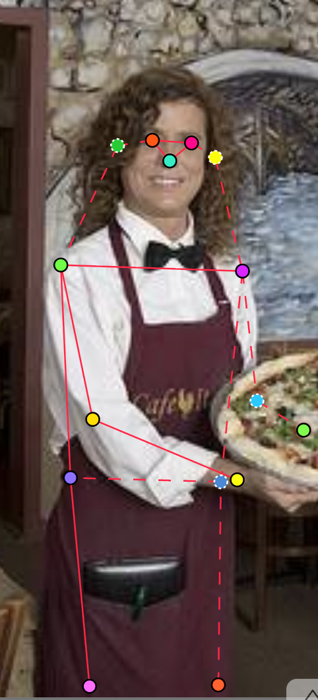
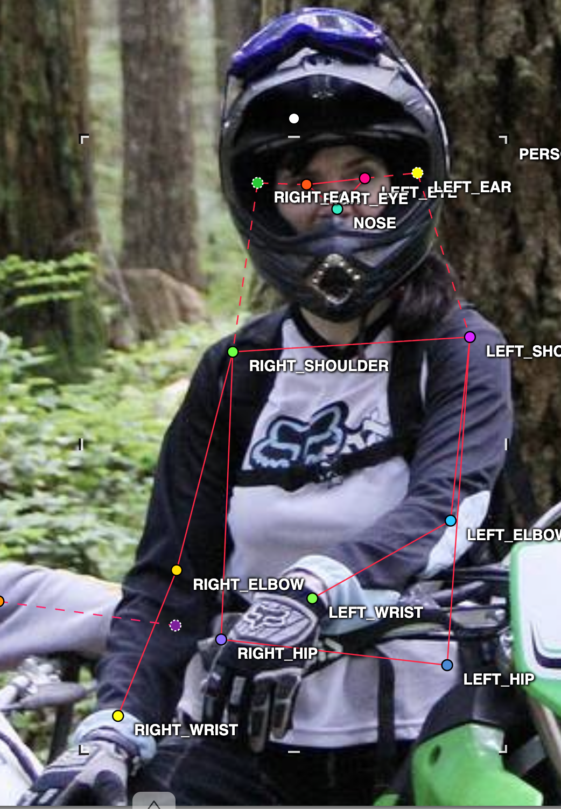
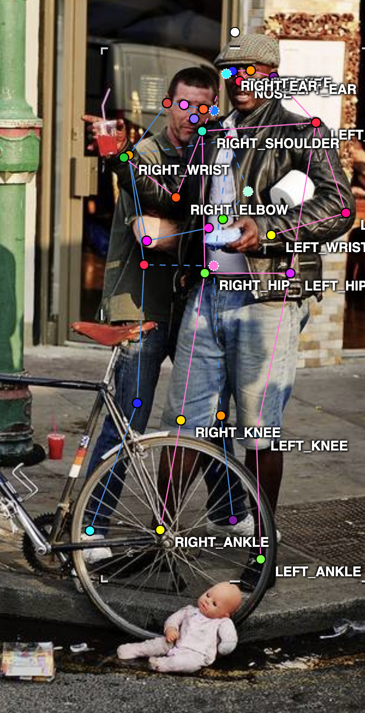
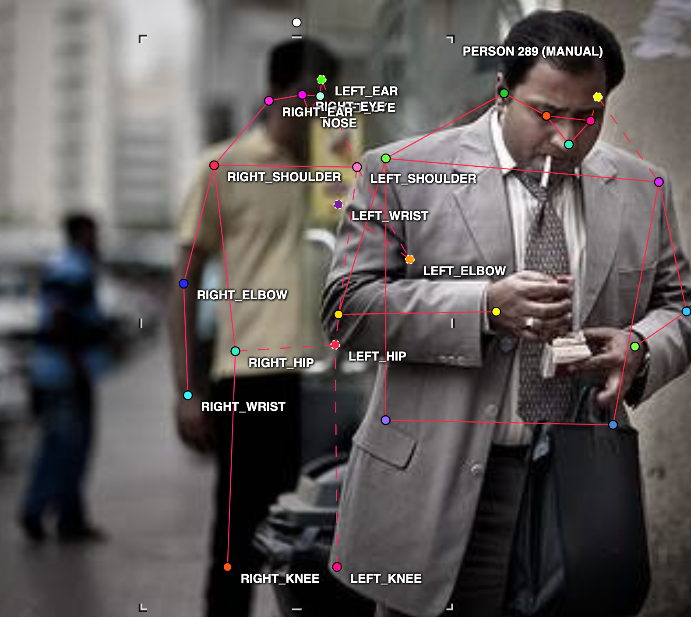

e

# Mini guideline - nhóm: ______  |  người gán: Nguyễn Thành Đạt  |  ngày: 16/9/2026

Điền file này **trong lúc** gán nhãn, không phải sau khi xong. Mỗi lần bạn dừng lại

> hơn 10 giây để phân vân, đó là một dòng phải ghi vào đây.

## 1. Luật bắt buộc (đã thống nhất cả lớp - không sửa)

- Bộ 17 điểm COCO, đúng tên, đúng thứ tự. Lấy từ file `.SVG` chung.
- Mọi người trong ảnh đều có **đủ 17 điểm**. Điểm không dùng được thì gắn cờ, không xoá.
- Trái/phải tính theo **cơ thể người**, không theo bức ảnh.
- Bị che, còn trong khung -> `v = 1`, **vẫn đặt chấm** ở vị trí ước lượng.
- Ra ngoài mép ảnh -> `v = 0`, **không** đặt chấm.
- Không dùng `Hidden` (`h`) - nó không được lưu vào file.

## 2. Luật của nhóm bạn (phải điền)

| Tình huống                                                                                                                 | Luật nhóm bạn chọn                                                                                                                               | Vì sao                                                      |
| ---------------------------------------------------------------------------------------------------------------------------- | ---------------------------------------------------------------------------------------------------------------------------------------------------- | ------------------------------------------------------------ |
| Hông của người mặc quần áo dài                          | Ước lượng vị trí khớp hông dựa trên cấu trúc xương chậu và điểm giao giữa thân người với chân (v=1)                          | Do vẫn nằm trong khung hình                               |
| Tai bị tóc hoặc mũ bảo hiểm che một phần                | Vẫn đặt chấm (`v = 1`) tại vị trí tâm của vành tai hoặc ước lượng theo phần lộ ra / đối xứng khuôn mặt.                      | Do vẫn nằm trong khung hình                               |
| Người bị cắt ở mép ảnh (chỉ thấy từ hông trở lên)  | các khớp nằm hoàn toàn ra ngoài mép ảnh thì đặt`v = 0`                                                                                  | Do nằm ngoài khung hình                                  |
| Cổ tay nằm sau tay lái / sau thân mình                                                                                  | Đặt chấm tại vị trí cổ tay bị che khuất với`v = 1` (dựa vào góc gập của khuỷu tay và bàn tay).                                   | Do vẫn nằm trong khung hình                               |
| Hai người chồng lên nhau                                    | ớc lượng vị trí khớp của người bị che dựa vào phần cơ thể lộ ra và cấu trúc giải phẫu thông thường, gán`v = 1`            | Do vẫn nằm trong khung hình                               |
| Người nhỏ đến mức nào thì không gán nữa              | Bỏ qua những người có chiều cao tổng thể nhỏ hơn một ngưỡng nhất định (ví dụ: nhỏ hơn 30x30 pixels hoặc quá mờ ở hậu cảnh) | việc gán sẽ gây nhiễu (noise) cho trọng số của model |

Với mỗi luật, chèn **một ảnh mẫu** (screenshot từ CVAT) thay vì chỉ viết một câu.
Slide 12 nói rõ: khớp không có bề mặt nhìn thấy được thì phải có ảnh mẫu, không phải
một câu văn chung chung.

## 3. Ba ca mơ hồ đã gặp (bắt buộc, ghi ít nhất 3)

### Ca 1 - ảnh `train_02.jpg`, người thứ 37 khớp `nose, left_eye, left_ear, right_eye, right_ear`

- Mơ hồ ở chỗ nào: Không xác định dc vị trí
- Bạn quyết thế nào: ước lượng vị trí theo cảm giác
- Vì sao: vẫn phải xác định do khớp vẫn nằm trong khung hình
- Nếu người khác quyết ngược lại thì model học sai cái gì: nếu ko ước lượng vị trí, model sẽ hiểu nhầm trong khung ảnh có khớp đấy

### Ca 2 - ảnh `__train_01.jpg____`, người thứ `_01__`, khớp `___RIGHT_KNEE, LEFT_KNEE___`

- Mơ hồ ở chỗ nào: hai phần đầu gối bị che khuất bởi tạp đề to.
- Bạn quyết thế nào: dựa vào đặc điểm cấu trúc cơ thể để ước lượng và đánh keypoints
- Vì sao: Vì nếu đánh bừa hoặc đánh theo mép của tạp đề có thể dẫn đến sai lệch
- Nếu người khác quyết ngược lại thì model học sai cái gì: model có thể học sai và nếu là đối tượng khác với bộ quần áo to hơn thì sẽ nhận diện sai

### Ca 3 - ảnh `___train_13.jpg___`, người thứ `_289__`, khớp `______`

- Mơ hồ ở chỗ nào: người ở xa, khá mờ
- Bạn quyết thế nào: dựa vào hình ảnh, vẫn sẽ đánh keypoints những phần có thể nhìn thấy được
- Vì sao: Vị trí đứng của người đó vẫn chă quá xa để mà lược bỏ đi
- Nếu người khác quyết ngược lại thì model học sai cái gì: có thể khi thấy mờ và xa sẽ bỏ đi không đánh keypoints dẫn đến khi train model sẽ không học được những người ở xa đó

## 4. Sau khi so visibility report với bạn cùng nhóm

- Khớp lệch `%v=1` nhiều nhất: `______` (bạn `___%` / họ `___%`)
- Nguyên nhân là **guideline chưa rõ** hay **một trong hai bên gán sai**:
- Luật mới bổ sung vào mục 2 sau khi thống nhất:
